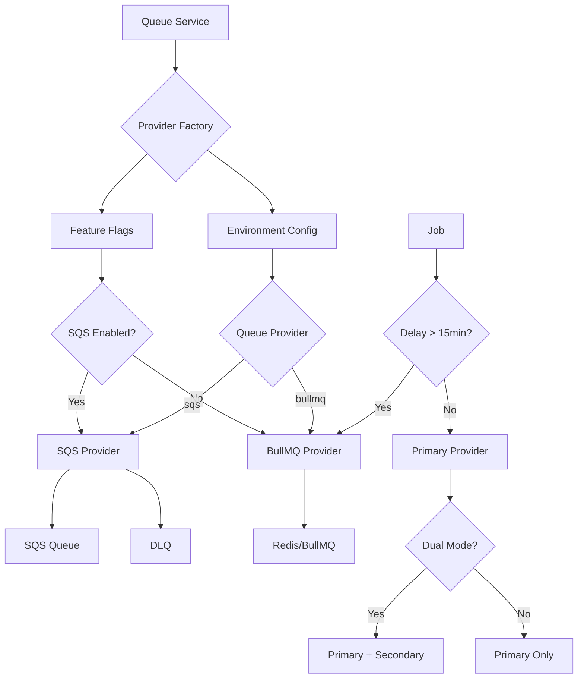

# SQS Queue Integration

This document provides a comprehensive guide for configuring and using the SQS queue integration in Novu, which allows using Amazon SQS as an alternative to BullMQ for job processing.

## Table of Contents

- [Overview](#overview)
- [Architecture](#architecture)
- [Configuration](#configuration)
- [Migration Guide](#migration-guide)
- [Monitoring & Troubleshooting](#monitoring--troubleshooting)
- [Best Practices](#best-practices)
- [Limitations](#limitations)
- [FAQ](#faq)

## Overview

The SQS integration provides:

- **Dual Queue Support**: Run both BullMQ and SQS workers simultaneously during migration
- **Intelligent Job Routing**: Automatically route jobs based on delay requirements
- **Feature Flag Control**: Gradual rollout with instant rollback capabilities
- **Backward Compatibility**: Existing BullMQ functionality remains unchanged
- **Community Edition Safe**: Community users always use BullMQ regardless of configuration

## Architecture



## Configuration

### Environment Variables

#### Required for SQS

```bash
# Queue provider selection
QUEUE_PROVIDER=sqs                     # Options: 'bullmq' | 'sqs'

# AWS Configuration
AWS_SQS_REGION=us-east-1              # AWS region for SQS
AWS_SQS_ACCESS_KEY_ID=your_access_key  # AWS access key
AWS_SQS_SECRET_ACCESS_KEY=your_secret  # AWS secret key
AWS_SQS_QUEUE_URL_PREFIX=https://sqs.us-east-1.amazonaws.com/123456789012

# Feature Flag
IS_SQS_QUEUE_ENABLED=true             # Enable SQS writes
```

#### Optional Configuration

```bash
# Dead Letter Queue (optional)
AWS_SQS_DLQ_URL_PREFIX=https://sqs.us-east-1.amazonaws.com/123456789012

# SQS Settings
AWS_SQS_MAX_RECEIVE_COUNT=3           # Default: 3
AWS_SQS_VISIBILITY_TIMEOUT=30         # Default: 30 seconds
AWS_SQS_MESSAGE_RETENTION_PERIOD=345600  # Default: 4 days
SQS_BATCH_SIZE=10                     # Default: 10
SQS_POLLING_WAIT_TIME=20              # Default: 20 seconds

# Migration Control
ENABLE_DUAL_QUEUE_PROCESSING=false    # Default: false
```

### AWS IAM Permissions

The service requires the following SQS permissions:

```json
{
  "Version": "2012-10-17",
  "Statement": [
    {
      "Effect": "Allow",
      "Action": [
        "sqs:ReceiveMessage",
        "sqs:DeleteMessage",
        "sqs:DeleteMessageBatch",
        "sqs:SendMessage",
        "sqs:SendMessageBatch",
        "sqs:GetQueueAttributes",
        "sqs:ChangeMessageVisibility",
        "sqs:ChangeMessageVisibilityBatch"
      ],
      "Resource": [
        "arn:aws:sqs:us-east-1:123456789012:novu-*"
      ]
    }
  ]
}
```

### SQS Queue Setup

Create the following queues in AWS SQS:

```bash
# Main queues
novu-standard-queue
novu-workflow-queue
novu-subscriber-queue
novu-inbound-queue
novu-websockets-queue
novu-metrics-queue

# Dead letter queues (optional but recommended)
novu-standard-dlq
novu-workflow-dlq
novu-subscriber-dlq
novu-inbound-dlq
novu-websockets-dlq
novu-metrics-dlq
```

## Migration Guide

### Phase 1: Preparation

1. **Create SQS Queues**
   ```bash
   # Use AWS CLI or Console to create queues
   aws sqs create-queue --queue-name novu-standard-queue
   aws sqs create-queue --queue-name novu-workflow-queue
   # ... create other queues
   ```

2. **Configure Dead Letter Queues**
   ```bash
   aws sqs set-queue-attributes --queue-url $QUEUE_URL --attributes '{
     "RedrivePolicy": "{\"deadLetterTargetArn\":\"$DLQ_ARN\",\"maxReceiveCount\":3}"
   }'
   ```

3. **Set Up IAM Permissions**
   - Create IAM user/role with SQS permissions
   - Generate access keys for the service

### Phase 2: Enable Dual Processing

```bash
# Enable dual mode to run both workers
ENABLE_DUAL_QUEUE_PROCESSING=true
QUEUE_PROVIDER=bullmq
IS_SQS_QUEUE_ENABLED=false
```

Deploy and verify both worker types are running:

```bash
# Check logs for dual queue initialization
grep "Dual queue processing enabled" /var/log/novu-worker.log
```

### Phase 3: Start Writing to SQS

```bash
# Begin writing to SQS while processing from both
ENABLE_DUAL_QUEUE_PROCESSING=true
QUEUE_PROVIDER=sqs
IS_SQS_QUEUE_ENABLED=true
```

Monitor queue depths and processing rates:

```bash
# Monitor SQS queue metrics
aws sqs get-queue-attributes --queue-url $QUEUE_URL --attribute-names ApproximateNumberOfMessages

# Monitor BullMQ queues  
redis-cli llen bull:standard:waiting
```

### Phase 4: Complete Migration

```bash
# Switch to SQS only
ENABLE_DUAL_QUEUE_PROCESSING=false
QUEUE_PROVIDER=sqs
IS_SQS_QUEUE_ENABLED=true
```

### Rollback Procedure

At any stage, rollback by setting:

```bash
QUEUE_PROVIDER=bullmq
IS_SQS_QUEUE_ENABLED=false
ENABLE_DUAL_QUEUE_PROCESSING=false
```

## Monitoring & Troubleshooting

### Key Metrics to Monitor

1. **Queue Depths**
   ```bash
   # SQS metrics
   aws cloudwatch get-metric-statistics \
     --namespace AWS/SQS \
     --metric-name ApproximateNumberOfMessages
   
   # BullMQ metrics  
   redis-cli info keyspace
   ```

2. **Processing Rates**
   - Messages processed per minute
   - Error rates
   - Consumer lag

3. **Error Patterns**
   ```bash
   # Check for delay routing
   grep "routing to BullMQ" /var/log/novu-worker.log
   
   # Check for fallback usage
   grep "Falling back to BullMQ" /var/log/novu-worker.log
   ```

### Common Issues

#### Jobs Not Processing

1. **Check SQS Configuration**
   ```bash
   # Verify queue URLs are accessible
   aws sqs get-queue-url --queue-name novu-standard-queue
   ```

2. **Verify Permissions**
   ```bash
   # Test SQS access
   aws sqs send-message --queue-url $QUEUE_URL --message-body "test"
   ```

3. **Check Feature Flags**
   ```bash
   # Ensure feature flag is enabled
   echo $IS_SQS_QUEUE_ENABLED
   ```

#### Delayed Jobs Not Working

Delayed jobs > 15 minutes automatically route to BullMQ:

```bash
# Look for delay routing logs
grep "delay.*routing to BullMQ" /var/log/novu-worker.log
```

#### High Error Rates

1. **Check Dead Letter Queues**
   ```bash
   aws sqs get-queue-attributes --queue-url $DLQ_URL --attribute-names ApproximateNumberOfMessages
   ```

2. **Review Consumer Errors**
   ```bash
   grep "SQS.*Error" /var/log/novu-worker.log
   ```

## Best Practices

### 1. Queue Configuration

- **Set appropriate visibility timeout**: Should be longer than your typical job processing time
- **Configure dead letter queues**: Essential for handling failed messages
- **Use message retention**: Keep messages for adequate time (4+ days recommended)

### 2. Monitoring

- **Set up CloudWatch alarms** for queue depth and error rates
- **Monitor both queue systems** during migration
- **Track delay routing** to ensure proper job distribution

### 3. Error Handling

- **Implement retry logic** in your job processors
- **Monitor dead letter queues** regularly
- **Set up alerts** for high error rates

### 4. Performance

- **Tune batch sizes** based on job complexity
- **Adjust polling wait times** for responsiveness vs cost
- **Use appropriate instance sizes** for high throughput

## Limitations

### SQS Limitations

1. **Message Delay**: Maximum 15 minutes (jobs with longer delays route to BullMQ)
2. **Message Size**: 256 KB maximum
3. **Batch Size**: 10 messages per batch
4. **Visibility Timeout**: 12 hours maximum

### Integration Limitations

1. **No Job Scheduling**: SQS doesn't support cron-like scheduling
2. **Limited Job Introspection**: Fewer monitoring capabilities compared to BullMQ
3. **No Job Prioritization**: SQS processes messages in FIFO order

### Community Edition

- SQS integration is **not available** in community edition
- All queue operations fall back to BullMQ automatically
- No configuration changes needed for community users

## FAQ

### Q: Can I use SQS FIFO queues?

**A:** The current implementation uses standard SQS queues. FIFO queues have additional limitations and are not currently supported, but could be added in the future.

### Q: What happens to jobs with delays > 15 minutes?

**A:** These jobs are automatically routed to BullMQ, which supports longer delays. The routing is transparent and logged.

### Q: How do I monitor queue performance?

**A:** Use AWS CloudWatch for SQS metrics and Redis monitoring for BullMQ. The service logs processing times and error rates.

### Q: Can I switch back to BullMQ after migrating to SQS?

**A:** Yes, set `QUEUE_PROVIDER=bullmq` and `IS_SQS_QUEUE_ENABLED=false`. The switch is immediate.

### Q: What's the performance difference between BullMQ and SQS?

**A:** SQS offers better scalability and managed infrastructure, while BullMQ provides more features and lower latency. Choose based on your specific needs.

### Q: How does this affect existing workflows?

**A:** Existing workflows continue working unchanged. The queue provider is abstracted away from business logic.

### Q: What AWS costs should I expect?

**A:** SQS costs depend on message volume. See [AWS SQS Pricing](https://aws.amazon.com/sqs/pricing/) for current rates. Factor in message sends, receives, and data transfer.

---

For additional support or questions, please refer to the Novu documentation or contact the development team.
